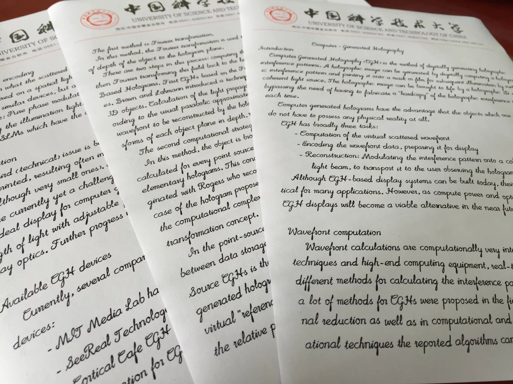
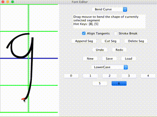

# Muse-CGH
[点击此处阅读中文版(Click here to read the Chinese version)](README_CH.md)
### A program to synthesize stylish Computer Generated Handwriting.

you can [download the compiled program (v1.4.2)](https://github.com/MrVPlusOne/Muse-CGH/releases/download/v1.4.2/Muse_1.4.2.zip) directly (.jar file)

### Overview

##### Muse can synthesize stylish English handwriting from plain texts. Its algorithm carefully connects strokes of adjacent characters to create cursive words and uses random perturbations to ensure that every character is unique in the rendering results.

##### The following photo shows some rendered text printed on paper:




#### You can learn more about Muse's features by watching videos on my [homepage](https://mrvplusone.github.io/gallery-muse.html).

### Usage

##### Muse works in two modes: GUI mode and Command-line mode.
 - The GUI mode is the easiest way to use Muse, as it provides interactive editing experience. Just enter the text, click the 'render' button, and you will see the rendered result immediately. If you are not satisfied with the result, just adjust parameters on the control panel, the result then updates accordingly.
 - The Command-line mode can be very helpful if you plan to use Muse in non-Scala projects.

#### GUI mode

##### If you run Muse directly (by double click on the .jar file or by providing no command-line arguments), the program will start in GUI mode.


##### In the image shown above, the upper right panel is Muse's Rendering Result Panel, where the rendered image or animation is presented; the upper left panel is Control Panel, a place you enter text or adjust parameters; the button left panel is the Console Output Panel, it tells you information about Muse's state.

 - At the bottom of Control Panel, there are two checkboxes. If you check the 'Interactive' box, every time you change the text content, without clicking 'Render' button, the Result Panel will update automatically. If you check the 'Animation' box, Result Panel will change into animation mode, then you can watch Muse writing in action!

 - At the top of Control Panel, there are two buttons. Click the 'Font Editor' button to bring up the font editor. You can create new Muse Characters or modify the existent ones as you wish. After saving your changes in the font editor, click the 'Reload Letters' button in the Control Panel to let Muse reload character map from disk. (Muse load its characters from a folder named 'letters' in its current directory)

 - As you can see, there're quite many parameters you can change. Help texts will show up if you hover the mouse cursor over them.

##### With Muse's newly updated *Font Editor*, you can design your own fonts with ease.



#### Command-line mode

##### Muse use [scopt](https://github.com/scopt/scopt) to parse Command-line arguments.

If you provide at least one command-line arg, Muse will enter command-line mode.

##### Some examples (here '$' is the command-line prompt):

```
$ java -jar Muse.jar SampleText.txt --out myPngResult.png --FontSize 30
letters missing:
-----
arguments parsed
start to render text...
rendering finished.

start to paint text...
painting time use 105 ms.
painting finished.
saving results...
results saved to /Users/weijiayi/Desktop/Muse1.3/myPngResult.png
$
```

In the example above, you use `java -jar Muse.jar` to run Muse in command-line, then you provide the name or path of a text file (SampleText.txt in this case) as an argument. You can also use options to override the default rendering parameters.

##### If wrong command-line arguments are provided, Muse will print out the usage text, in which all settable parameters along with their descriptions, constraints and default values are given.

```
$ java -jar Muse.jar --WrongArg
Error: Unknown option --WrongArg
Error: Missing argument <input file>
muse 1.3
Usage: muse [options] <input file>

  <input file>
        the input file to read.
  -o <value> | --out <value>
        the out image name (if no extension specified, use .png)
  --LineWidth <value>
        Line width: maximum line width, must be greater than Break threshold (default: 90.0)
  --LineSpacing <value>
        Line spacing: distance between lines, must be positive (default: 4.0)
  --BreakThreshold <value>
        Break threshold: maximum empty space allowed before breaking the last word in a line, must be smaller than Line width (default: 4.0)
  --AspectRatio <value>
        Aspect Ratio: the ratio of image height and width, use automatic aspect ratio if specified as negative, must be float number (default: -1.0)
  --PixelDensity <value>
        Pixel density: how many pixels per unit length, a lower case 'a' is about 1 unit high, must be positive (default: 10.0)
  --Samples <value>
        Samples: how many quadrilaterals are used per unit length, must be positive (default: 50.0)
  --Lean <value>
        Lean: tan value of the sloping angle, must be float number (default: 0.3)
  --Thickness <value>
        Thickness: the thickness of strokes, must be positive (default: 2.8)
  --SpaceWidth <value>
        Space width: the size in unit for a whitespace, must be positive (default: 0.8)
  --LetterSpacing <value>
        Letter spacing: extra spacing between letters in a word, must be float number (default: 0.0)
  --MarkSpacing <value>
        Mark spacing: extra spacing for punctuation marks and numbers, must be float number (default: 0.4)
  --LetterRandom <value>
        Letter Random: how much randomness is used for letters in words, must be float number (default: 0.07)
  --LineRandom <value>
        Line Random: how much randomness is used for height perturbation of words in a line, must be float number (default: 0.1)

```


### How to use the source code

You can run the source code as an sbt project. A [build.sbt](build.sbt) file has been added to this project recently.


### License
##### This work is under [the MIT license](LICENSE.txt), so feel free to use it in your own projects :)

