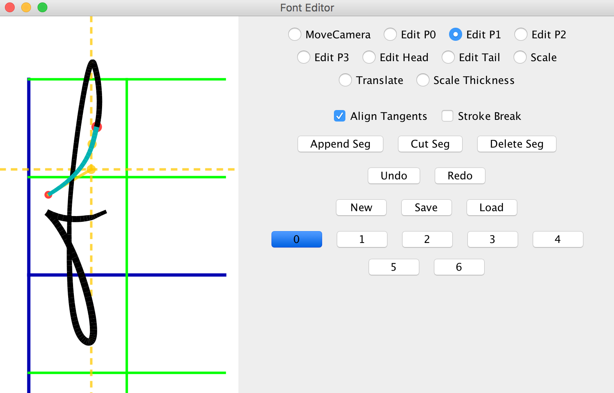

# Muse-CGH
### A program to convert text into human-style Computer Generated Handwritings.

#### you can [download the compiled program (v1.1)](https://github.com/MrVPlussOne/Muse-CGH/releases/download/v1.1/Muse1.1.zip) directly (.jar file)

#### Muse can generate human-style English handwriting from text. Its algorithm will connect the strokes of adjacent characters to produce cursive words, and uses randomness to ensure that every character is unique in the rendering results.

##### The following photo shows some rendered text printed on papers. As you can see, it's quite vivid:

* You can use Muse through its easy-to-use graphical user interface. With interactive editing mode turned on, you will see the rendering results changing as you typing.

* The **render** package contains functions to automatically typeset texts and paint them on the screen. It can generate animations too, so you can watch Muse writing in action!

* The **editor** package contains a font editor GUI allowing the user to design their own fonts.

#### This work is under [the MIT license](LICENSE.txt), so feel free to use it in your own projects. There's a plan for command line-interface support.
