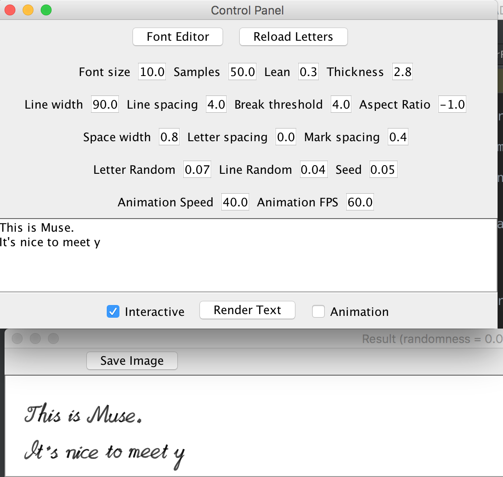

# Muse-CGH
### A program to make Computer Generated Handwriting [with cursive and *random(ok, not random yet)* letters]

#### you can [download the compiled program](Muse.zip) directly (.jar file)

* The **main** package contains core classes.

* The **render** package contains functions to automatically typeset texts and paint them on the screen. It can generate animations too, so you can watch Muse writing in action!

* Muse has an easy to use user interface, with interactive editing support, you can see the rendering results while you typing.

* The **editor** package contains a font editor GUI allowing the user to design their own fonts.

