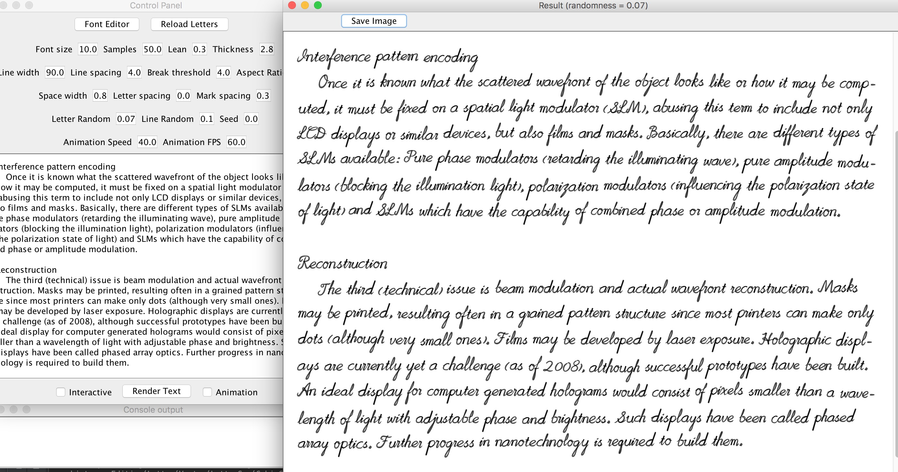

# Muse-CGH
### A program to make Computer Generated Handwriting [with cursive and random letters]

#### you can [download the compiled program (v1.1)](https://github.com/MrVPlussOne/Muse-CGH/releases/download/v1.1/Muse1.1.zip) directly (.jar file)

#### Muse can generate human-lick English handwriting from text. Its algorithm will connect the strokes of adjacent characters in a word, using randomness to ensure that every character is unique in the rendering result.

##### The following photo shows some rendered text printed on a paper. As you may agree, it's quite pretty and vivde:

* Muse has an easy to use user interface, with interactive editing support, you can see the rendering results while you typing.

* The **render** package contains functions to automatically typeset texts and paint them on the screen. It can generate animations too, so you can watch Muse writing in action!

* The **editor** package contains a font editor GUI allowing the user to design their own fonts.

#### This work is under [the MIT liscence](LICENSE.txt), so feel free to use it in your own projects. There's a plan for command line-interface support.
