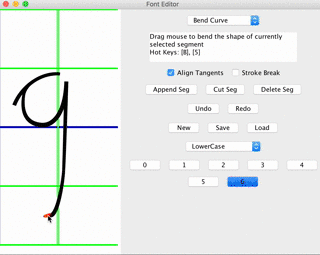

# Muse-CGH
[Click here to read in English(点击此处阅读英文版)](README.md)
### 一个由文本生成手写圆体英文的程序

你可以直接[下载编译好的程序 (v1.4.2)](https://github.com/MrVPlusOne/Muse-CGH/releases/download/v1.4.2/Muse_1.4.2.zip) (.jar 文件)

### 简介

##### Muse可将输入的文本转换为手写风格的圆体英文。其算法会自然地将相邻的字母连接起来，并使用随机算法来保证写下的每个字母都会有细微差别。

##### 下面的照片展示了Muse输出的效果 （先生成图片，再打印到纸上）


### 用法

##### Muse可在两种模式下工作: 图形界面（GUI）模式 和 命令行模式. 
 - GUI模式中使用Muse非常容易，因为其提供交互的用户体验。你只需要输入想渲染的文本, 再点击'render'按钮, 你就会立刻看见生成的结果。如果你对结果还不满意，可在控制面板上调整各个参数，每当你改变参数的值，结果会随之而更新。
 - 命令行模式则可方便的用于非Scala项目。

#### GUI模式介绍

##### 如果你直接运行Muse(通过双击Muse.jar或者在命令行中不提供任何参数)，程序便会进入GUI模式。


##### 在上面的截图中，右上方的面板为Muse的结果面板，渲染的图片或者动画会在此显示；左上方则为控制面板，你可在此输入文本及调整参数；左下方的为控制台面板，它会输入关于Muse运行状态的信息。

 - 在控制面板下方有两个勾选框。如果你勾上'Interactive'，那么每次你改变了文本的内容，无需再点击'Render'，结果就会自动动态的更新。如果你勾上'Animation'，则结果面板会进入动画模式，然后你便能够欣赏Muse的手写Show了！
 
 - 在控制面板上方有两个按钮。点击'Font Editor'按钮会调出字体编辑器。你可以用它创建新的Muse符号或者编辑已有的符号。保存过更改之后，通过点击控制面板中的'Reload Letters'按钮，Muse会重新读取字符表，应用最新的字符。（Muse默认从其.jar文件所在目录中的'letters'文件夹中读取字符）。
 
 - 如你所见，Muse有不少参数可以调整。当你将鼠标悬停至其中某个参数上时，帮助信息会浮现。

##### 使用Muse自带的字体编辑器，你可以轻松的创建新的字体。



#### 命令行模式介绍

##### Muse使用[scopt](https://github.com/scopt/scopt)来解析命令行参数。

当你提供至少一个命令行参数时，Muse会进入命令行工作模式。

##### 一个用例(此处'$'代表命令行的输入提示):

```
$ java -jar Muse.jar SampleText.txt --out myPngResult.png --FontSize 30
letters missing: 
-----
arguments parsed
start to render text...
rendering finished.

start to paint text...
painting time use 105 ms.
painting finished.
saving results...
results saved to /Users/weijiayi/Desktop/Muse1.3/myPngResult.png
$ 
```

在上面的例子中，你使用`java -jar Muse.jar`来从命令行调用Muse,紧接着你提供要渲染的文本的路径(SampleText.txt)作为Muse的参数。 然后你使用一系列可选的选项来覆盖Muse的默认参数。（比如此处用--FontSize 30来将字体大小设置为30）

##### 当你提供的参数有误时，Muse会在命令行中显示使用说明。这其中便包括了所有的可调整参数，以及它们的说明，取之要求和默认值。

```
$ java -jar Muse.jar --WrongArg
Error: Unknown option --WrongArg
Error: Missing argument <input file>
muse 1.3
Usage: muse [options] <input file>

  <input file>
        the input file to read.
  -o <value> | --out <value>
        the out image name (if no extension specified, use .png)
  --LineWidth <value>
        Line width: maximum line width, must be greater than Break threshold (default: 90.0)
  --LineSpacing <value>
        Line spacing: distance between lines, must be positive (default: 4.0)
  --BreakThreshold <value>
        Break threshold: maximum empty space allowed before breaking the last word in a line, must be smaller than Line width (default: 4.0)
  --AspectRatio <value>
        Aspect Ratio: the ratio of image height and width, use automatic aspect ratio if specified as negative, must be float number (default: -1.0)
  --PixelDensity <value>
        Pixel density: how many pixels per unit length, a lower case 'a' is about 1 unit high, must be positive (default: 10.0)
  --Samples <value>
        Samples: how many quadrilaterals are used per unit length, must be positive (default: 50.0)
  --Lean <value>
        Lean: tan value of slopping angle, must be float number (default: 0.3)
  --Thickness <value>
        Thickness: the thickness of strokes, must be positive (default: 2.8)
  --SpaceWidth <value>
        Space width: the size in unit for a whitespace, must be positive (default: 0.8)
  --LetterSpacing <value>
        Letter spacing: extra spacing between letters in a word, must be float number (default: 0.0)
  --MarkSpacing <value>
        Mark spacing: extra spacing for punctuation marks and numbers, must be float number (default: 0.4)
  --LetterRandom <value>
        Letter Random: how much randomness is used for letters in words, must be float number (default: 0.07)
  --LineRandom <value>
        Line Random: how much randomness is used for height perturbation of words in a line, must be float number (default: 0.1)

```


### License
##### 本项目使用[the MIT license](LICENSE.txt)，希望Muse能帮助到你！

